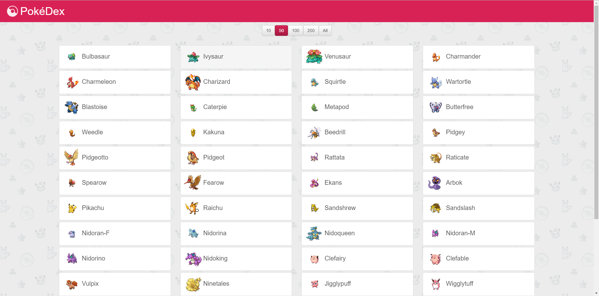
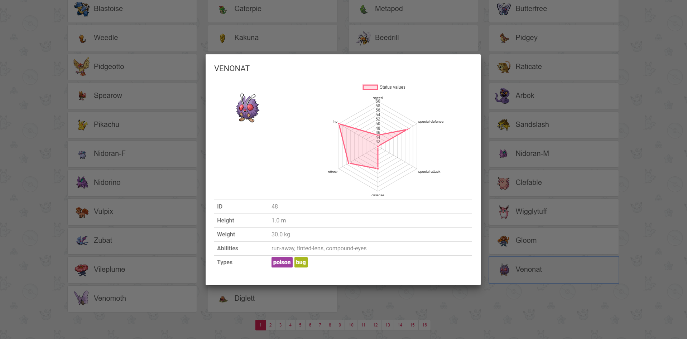

# ReactJS-Pokedex

Pokedex app using ReactJS, [pokeapi.co](www.pokeapi.co), [Bootstrap](https://react-bootstrap.github.io/), [MaterialUI](http://www.material-ui.com/) and [react-chartjs-2](https://github.com/jerairrest/react-chartjs-2).
I implemented this as a little ReactJS exercise.

## Getting started

```sh
git clone git@github.com:S-Anteboth/ReactJS-Pokedex.git
cd pokedex
npm install
npm start
```

## Screenshots



